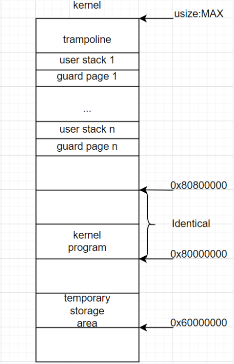
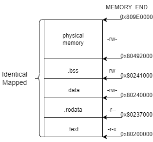
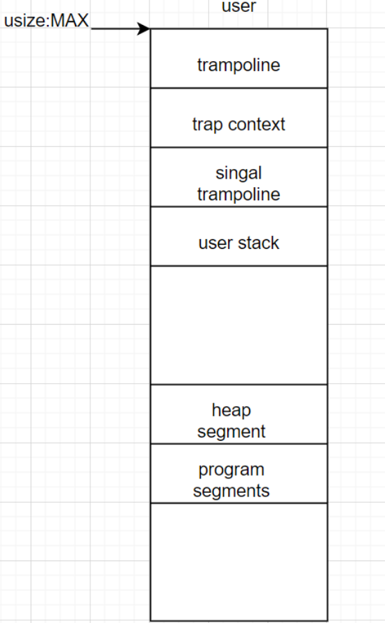

# 内存管理基础

$\qquad$下面先介绍一下“虚拟内存”和“物理内存“概念。

### 虚拟内存

虚拟内存是指在程序的角度看到的内存空间大小，并且是连续的地址空间（只是看上去），如在 32 位平台下，寻址的范围是 2^32 也就是 4 GB，那么每个进程的虚拟内存大小就是 4 GB。

虚拟内存的出现隔离了不同进程的地址空间，各个程序在编写时只需要关注虚拟内存，这个虚拟内存在看上去全部归本进程所有，无需考虑与别的进程之间的进程干扰。

虚拟内存是操作系统对程序玩的把戏，让程序以为自己独占了很大范围的内存空间，对上有利于程序的编写，对下有利于物理内存的利用。下面介绍物理内存的概念。

### 物理内存

物理内存是实际存在的内存空间，是硬件设备所具有的内存空间，如一台计算机内存条大小是 4 GB，那么这台计算机的物理内存大小就是 4 GB。

物理内存的空间往往很有限，往往远小于虚拟内存空间，这就导致虚拟内存并不会被完全对应物理内存，而是需要的时候再分配物理内存空间。这种策略的好处是，虚拟内存与物理内存的对应由操作系统来实现，对于程序来讲是无感的，虚拟内存用到时再动态分配，这样更有利于物理内存的利用率，更好的管理硬件资源。

需要注意的是，在虚拟内存上连续的空间，分配到物理内存中不一定是连续的。

## 内核虚拟地址空间和物理地址空间分布

首先看一下`NPUcore`团队绘制的内核虚拟地址空间分布图：



- **trampoline**

**跳板**（trampoline），跳板页面的大小是 1 page，这个页面在地址空间的最高虚拟页面上。

在内核空间中，跳板唯一的用途就是发生`panic`。

- **user stack**

接下来则是从高到低放置用户栈，栈向下增长。每个user stack的大小为 1 page。

需要注意的是这里的user stack并不专指用户栈，当某个进程处于S模式时，内核将使用此区域作为内核堆栈。

- **guard page**

相邻两个内核栈之间会预留一个 **保护页面** (Guard Page) ，页面大小也是 1 page。

这些页面位于堆栈页面之下。它们未被分配，这意味着如果内核使用这些区域中的数据，将捕获页面错误。它们保护内核不修改另一个进程的堆栈数据。

由于编译器会对访存顺序和局部变量在栈帧中的位置进行优化，我们难以确定一个已经溢出的栈帧中的哪些位置会先被访问，但总的来说，保护页面大小被设置的越大，我们就能越早捕获到这一可能覆盖其他重要数据的错误异常。由于我们的内核非常简单且内核栈的大小设置比较宽裕，在当前的设计中我们仅将其大小设置为单个页面。

- **kernel program**

这里将加载内核程序。之后会详细介绍。

- **temporary storage area**

临时存储区域，这个区域最多占据 512 pages。

这个区域现在用于exec系统调用，这意味着文件将首先加载到这里。


接下来我们详细介绍**kernel program**附近区域：

在内核运行时会输出如下内容：

```
.text [0x80200000, 0x80237000)
.rodata [0x80237000, 0x80240000)
.data [0x80240000, 0x80241000)
.bss [0x80241000, 0x80492000)
mapping .text section
mapping .rodata section
mapping .data section
mapping .bss section
mapping physical memory
mapping memory-mapped registers
```

上述输出的内容对应以下创建内核地址空间的方法 `new_kernel`的代码：

```rust
//os/src/mm/memory_set.rs

extern "C" {
    fn stext();
    fn etext();
    fn srodata();
    fn erodata();
    fn sdata();
    fn edata();
    fn sbss_with_stack();
    fn ebss();
    fn ekernel();
    fn strampoline();
    fn ssignaltrampoline();
}
impl MemorySet {
	/// Create an empty kernel space.
    /// Without kernel stacks. (Is it done with .bss?)
    pub fn new_kernel() -> Self {
        let mut memory_set = Self::new_bare();
        // map trampoline
        memory_set.map_trampoline();
        // map kernel sections
        println!(".text [{:#x}, {:#x})", stext as usize, etext as usize);
        println!(".rodata [{:#x}, {:#x})", srodata as usize, erodata as usize);
        println!(".data [{:#x}, {:#x})", sdata as usize, edata as usize);
        println!(
            ".bss [{:#x}, {:#x})",
            sbss_with_stack as usize, ebss as usize
        );
        macro_rules! anonymous_identical_map {
            ($begin:expr,$end:expr,$permission:expr) => {
                memory_set
                    .push(
                        MapArea::new(
                            ($begin as usize).into(),
                            ($end as usize).into(),
                            MapType::Identical,
                            $permission,
                            None,
                        ),
                        None,
                    )
                    .unwrap();
            };
            ($name:literal,$begin:expr,$end:expr,$permission:expr) => {
                println!("mapping {}", $name);
                anonymous_identical_map!($begin, $end, $permission);
            };
        }
        anonymous_identical_map!(
            ".text section",
            stext,
            etext,
            MapPermission::R | MapPermission::X
        );
        anonymous_identical_map!(".rodata section", srodata, erodata, MapPermission::R); // read only section
        anonymous_identical_map!(
            ".data section",
            sdata,
            edata,
            MapPermission::R | MapPermission::W
        );
        anonymous_identical_map!(
            ".bss section",
            sbss_with_stack,
            ebss,
            MapPermission::R | MapPermission::W
        );
        anonymous_identical_map!(
            "physical memory",
            ekernel,
            MEMORY_END,
            MapPermission::R | MapPermission::W
        );

        println!("mapping memory-mapped registers");
        for pair in MMIO {
            anonymous_identical_map!(
                (*pair).0,
                ((*pair).0 + (*pair).1),
                MapPermission::R | MapPermission::W
            );
        }
        memory_set
    }
}
```

第 3 行用`extern "C"` 从 `os/src/linker-xxx.ld` 中引用了很多表示各个段位置的符号。可以看到在`os/src`目录下有三个`ld`文件：`linker-qemu.ld`，`linker-k210.ld`，`linker-fu740.ld`，分别对应`qemu`，`k210`和`fu740`三个平台。其实三者只有第三行`BASE_ADDRESS`不同，`k210`为`0x80020000`，`qemu`与`fu740`均为`0x80200000`。

之后在`MemorySet`的`new_kernel()`方法中，首先`map`了`trampoline`（这里不是恒等映射，因为`trampoline`在虚拟地址的最顶端，物理地址没有到那么高），接着恒等映射（可以通过`anonymous_identical_map!`匿名恒等映射宏来看出）内核的四个逻辑段 `.text/.rodata/.data/.bss`。最后恒等映射`physical memory`和`memory-mapped registers`。

之所以使用恒等映射到物理内存的方法，是因为这会使得我们在无需调整内核内存布局 `os/src/linker-xxx.ld` 的情况下就仍能像启用页表机制之前那样访问内核的各个段。

`MapPermission`是映射区域的权限，标志如下：

```rust
//os/src/mm/memory_set.rs

bitflags! {
    pub struct MapPermission: u8 {
        const R = 1 << 1;// 读
        const W = 1 << 2;// 写
        const X = 1 << 3;// 执行
        const U = 1 << 4;// 用户
    }
}
```

- `.text`

代码段，存放需要执行的代码，拥有读权限和执行权限。

- `.rodata`

只读数据段，存放只读数据，只拥有读权限。

- `.data`

数据段，存放的数据允许被读和写。

- `.bss`

静态内存分配段，存放程序中未初始化的全局变量，程序一开始就将其清零。

上面四个逻辑段的 U 标志位均未被设置，使得 CPU 只能在处于 S 特权级（或以上）时访问它们。

此外还有**physical memory**（物理内存），内核地址空间中需要存在一个恒等映射到内核数据段之外的可用物理页帧的逻辑段，这样才能在启用页表机制之后，内核仍能以纯软件的方式读写这些物理页帧。

有了以上的知识，可以画出这五段逻辑区域的地址空间分布如下图：



需要特别说明的是，这里画出的只是在`qemu`平台上的地址空间分布，在`k210`或`fu740`上可能会不一样。一是因为上文提到`k210`的`BASE_ADDRESS`为`0x80020000`，不同于`qemu`的`0x80200000`。二是因为`MEMORY_END`在不同平台上也不相同，具体如下：

```rust
//os/src/config.rs

#[cfg(all(not(feature = "board_k210"), not(feature = "board_fu740")))]
pub const MEMORY_END: usize = 0x809e_0000;
#[cfg(feature = "board_k210")]
pub const MEMORY_END: usize = 0x8080_0000;
#[cfg(feature = "board_fu740")]
pub const MEMORY_END: usize = 0x9000_0000;
```

最后只剩下`“mapping memory-mapped registers”`，是将`MMIO`中的地址进行恒等映射。

**MMIO**（Memory-mapped I/O，即内存映射I/O），通过将外围设备映射到内存空间，便于CPU的访问。使用这种处理方式，设备控制寄存器只是内存中的变量，可以和其他变量一样进行寻址，无需特殊的I/O指令（如`IN`，`OUT`）来读写设备控制器。而且这种方式可以将设备的读取权限管理同区域读取权限管理结合起来，这个区域没有`U`权限标志，那么就只可以在内核态被访问，无需特殊的保护机制。

`MMIO`取决于平台，列举如下：

```rust
//os/src/boards/qemu.rs
pub const MMIO: &[(usize, usize)] = &[
    (0x1000_0000, 0x1000),
    (0x1000_1000, 0x1000),
    (0xC00_0000, 0x40_0000),
];

//os/src/boards/fu740.rs
pub const MMIO: &[(usize, usize)] = &[
    (0x1000_0000, 0x1000),         // PRCI
    (DISK_IMAGE_BASE, 0x800_0000), // disk image
];

//os/src/boards/k210.rs
pub const MMIO: &[(usize, usize)] = &[
    // we don't need clint in S priv when running
    // we only need claim/complete for target0 after initializing
    (0x0C00_0000, 0x3000), /* PLIC      */
    (0x0C20_0000, 0x1000), /* PLIC      */
    (0x3800_0000, 0x1000), /* UARTHS    */
    (0x3800_1000, 0x1000), /* GPIOHS    */
    (0x5020_0000, 0x1000), /* GPIO      */
    (0x5024_0000, 0x1000), /* SPI_SLAVE */
    (0x502B_0000, 0x1000), /* FPIOA     */
    (0x502D_0000, 0x1000), /* TIMER0    */
    (0x502E_0000, 0x1000), /* TIMER1    */
    (0x502F_0000, 0x1000), /* TIMER2    */
    (0x5044_0000, 0x1000), /* SYSCTL    */
    (0x5200_0000, 0x1000), /* SPI0      */
    (0x5300_0000, 0x1000), /* SPI1      */
    (0x5400_0000, 0x1000), /* SPI2      */
];
```

其中每个元组的第一个数为起始地址，第二个数为区域大小。据此来分配`MMIO`，权限均为可读可写。

## 进程地址空间

同样首先看一下`NPUcore`团队绘制的进程虚拟地址空间分布图：




- **trampoline**

**跳板**（trampoline），跳板页面的大小是 1 page，这个页面在地址空间的最高虚拟页面上。它包含两个汇编程序：`__alltrap`和`__restore`（汇编代码在`os/src/trap/trap.S`），`__alltraps`从页面中的最低地址开始，`__restore`位于`__alltraps`之上。当`trap`发生时，`pc`（指令计数器）将被设置为`__alltraps`的入口地址。

也就是说当`trap`发生，将会执行跳板这部分的代码，作用为切换到进程地址空间，进行一些现场的保留和恢复。由于跳板中的代码执行完毕后会跳到别的内核地址执行程序代码，故得跳板这一名字。

- **trap context**

`trap`上下文保存段，大小为 1 page。

它只将发生`trap`时的上下文存储在页面的最低地址中。

- **signal trampoline**

信号跳板，页面大小为 1 page。

它包含一个汇编程序：`__call_sgreturn`，代码如下：

```asm
;os/src/trap/trap.S

__call_sigreturn:
    # ecall sys_sigreturn
    addi	a7, zero, 139
    ecall
```

`__call_sgreturn`从页面中的最低地址开始。当用户程序完成信号处理工作后，`pc`将设置为`__call_sgreturn`的入口。

`sigreturn`系统调用的作用类似自定义信号处理函数执行完后的内核接口。在用户态下用户是不可能通过`sp`(函数返回地址寄存器)来实现系统调用，所以借鉴`trampoline`的思想在用户态的指定位置存放一段汇编代码，汇编代码的功能是执行系统调用。 

至于单独设计一个信号跳板的原因，可以参考`NPUcore`团队写的`Doc/os/signal.md`文档。

- **user stack**

用户栈空间，大小为 40 pages。

```rust
//os/src/config.rs

pub const USER_STACK_SIZE: usize = PAGE_SIZE * 40;
```

使用到`USER_STACK_SIZE`的代码如下：

```rust
//os/src/mm/memory_set.rs

impl MemorySet {
	pub fn alloc_user_res(&mut self, tid: usize, alloc_stack: bool) {
        if alloc_stack {
            // alloc user stack
            let ustack_bottom = ustack_bottom_from_tid(tid);
            let ustack_top = ustack_bottom - USER_STACK_SIZE;
            self.insert_framed_area(
                ustack_top.into(),
                ustack_bottom.into(),
                MapPermission::R | MapPermission::W | MapPermission::U,
            );
            // 省略其余代码
        }
    }
}
```

> 注：`NPUcore`团队在`os/src/mm/memory distribution/memory distribution.md`中写到User Space的**user stack**为 20 pages。但是经过对代码的分析认为可能是上述文档没有根据代码及时更新。

- **heap segment**

堆段，最多 20 pages。

```rust
//os/src/config.rs

pub const USER_HEAP_SIZE: usize = PAGE_SIZE * 20;
```

它位于程序段之上，它的内存是动态的。`sbrk`系统调用可以设置其大小（也不能超过 20 pages）。

- **program segments**

用户程序段。

这里将加载`ELF`文件，**ELF**（Executable and Linkable Format），即可执行可链接文件格式，文件中为用户程序。


上面只是介绍在逻辑层面地址空间分布，下面具体介绍在`NPUcore`中对应的数据结构及方法。

**地址空间** 使用 `MemorySet` 类型来表示：

```rust
// os/src/mm/memory_set.rs

/// The memory "space" as in user space or kernel space
pub struct MemorySet {
    page_table: PageTable,
    /// The mapped area.
    /// Segments are implemented using this mechanism. In other words, they may be considered a subset of MapArea.
    /// Yet, other purposes may exist in this struct, such as file mapping.
    areas: Vec<MapArea>,
}
```

这里的内存空间既可以是用户空间，也可以是内核空间。其中包括该空间的多级页表（将在下一节展开讲解页表），`areas`是`MapArea`向量：

```rust
// os/src/mm/memory_set.rs

/// Map area for different segments or a chunk of memory for memory mapped file access.
pub struct MapArea {
    /// Range of the mapped virtual page numbers.
    /// Page aligned.
    /// Map physical page frame tracker to virtual pages for RAII & lookup.
    inner: LinearMap,
    /// Direct or framed(virtual) mapping?
    map_type: MapType,
    /// Permissions which are the or of RWXU, where U stands for user.
    map_perm: MapPermission,
    pub map_file: Option<Arc<dyn File>>,
}

pub enum MapType {
    Identical, // 直接映射
    Framed, // 虚拟映射
    // 每个虚拟页面都有一个新分配的物理页帧与之对应，虚地址与物理地址的映射关系是相对随机的
}
```

`MapPermission`是映射区域的权限，前文已经介绍过，`MapType`已在注释中说明。`map_file`指文件类型也可以被映射到此空间中。

用`MapArea`来表示不同段的映射区域或内存块，用于内存映射文件访问。`inner`是一种`LinearMap`类型，注意这里的页号是映射的虚拟页号范围（`VPNRange`），并且是页表对齐的。

```rust
pub struct LinearMap {
    vpn_range: VPNRange,
    frames: Vec<Frame>,
}
```

`Frame`是一个枚举类型，拥有在内存时和未分配时两种状态，在内存时为`FrameTracker`向量。

```rust
pub enum Frame {
    InMemory(Arc<FrameTracker>),
    Unallocated,
}
```

`FrameTracker`绑定每个物理页面，作为物理页面追踪器。将物理页面追踪器映射到虚拟页面有利于`RAII`和进行页面查找。

```rust
//os/src/mm/frame_allocator.rs

pub struct FrameTracker {
    pub ppn: PhysPageNum,
}
```

**RAII**（Resource Acquisition Is Initialization）,也称为“资源获取就是初始化”，简单的说，RAII 的做法是使用一个对象，在其构造时获取资源，在对象生命期控制对资源的访问使之始终保持有效，最后在对象析构的时候释放资源。

更简单的说，在这里就是使`FrameTracker`与物理页面具有相同的生命周期，在获取物理页面构建`FrameTracker`时就将物理页面初始化，在`drop` `FrameTracker`时也将自动回收物理页面。实现此效果的代码如下：

```rust
//os/src/mm/frame_allocator.rs

/// RAII phantom for physical pages 译：物理页面的RAII幻影
impl FrameTracker {
    pub fn new(ppn: PhysPageNum) -> Self {
        // page cleaning
        let dwords_array = ppn.get_dwords_array();
        for i in dwords_array {
            *i = 0;
        }
        Self { ppn }
    }
    pub unsafe fn new_uninit(ppn: PhysPageNum) -> Self {
        Self { ppn }
    }
}
impl Drop for FrameTracker {
    /// Automatically recycle the physical frame when
    fn drop(&mut self) {
        // println!("do drop at {}", self.ppn.0);
        frame_dealloc(self.ppn);
    }
}
```

需要说明的是`FrameTracker`的生命周期也被一层层绑定到它所在的逻辑段`MapArea`下，故当逻辑段被回收之后这些之前分配的物理页帧也会自动地同时被回收。同理，`MapArea`的生命周期也随着`MemorySet`，这样就做到了当一个地址空间 `MemorySet` 生命周期结束后，这些物理页帧都会被回收。


之前在分析内核地址空间分布时使用到了创建内核地址空间的方法 `new_kernel`的代码，这就是`MemorySet`接口下的一个方法，接下来分析与之相关的几个`MemorySet`接口下常用方法。

```rust
// os/src/mm/memory_set.rs

impl MemorySet {
    /// Create a new struct with no information at all.
    pub fn new_bare() -> Self {
        Self {
            page_table: PageTable::new(),
            areas: Vec::with_capacity(16),
        }
    }
}
```

`new_kernel`代码最开始就是调用这个`new_bare`方法，新建一个空的地址空间。包括新建一个空的页表和空的`areas`向量。

```rust
//os/src/mm/memory_set.rs

	/// Mention that trampoline is not collected by areas.
    fn map_trampoline(&mut self) {
        self.page_table.map(
            VirtAddr::from(TRAMPOLINE).into(),
            PhysAddr::from(strampoline as usize).into(),
            PTEFlags::R | PTEFlags::X,
        );
    }

//os/src/config.rs

pub const TRAMPOLINE: usize = usize::MAX - PAGE_SIZE + 1;
```

之后首先映射跳板区域，注意这个跳板区域并没有被包括在`areas`里。

`TRAMPOLINE`被设置为最高虚拟页面。以`32位`，页面大小`1K`为例来介绍这个表达式：

```rust
TRAMPOLINE = 0xffff_ffff - 0x1000 + 1 = 0xffff_f000
```

很巧妙的解决了任意位和任意页面大小的情况，都可以通过这个表达式来获取最高虚拟页面首地址。

物理地址是通过`extern "C"` 引用的外部符号`strampoline`，这个也在前文介绍过，还有很多引用来的外部符号，作为物理地址，此后不再赘述。

跳板页面存放的是可执行的代码，权限是读与执行。

其余区域的映射方式大致相同，（`trampoline`段区域的映射方式不同是因为它不会被包括在`areas`中），`NPUcore`定义了一个`anonymous_identical_map`宏，来减少重复代码。

```rust
//os/src/mm/memory_set.rs

macro_rules! anonymous_identical_map {
    ($begin:expr,$end:expr,$permission:expr) => {
        memory_set
            .push(
                MapArea::new(
                    ($begin as usize).into(),
                    ($end as usize).into(),
                    MapType::Identical,
                    $permission,
                    None,
                ),
                None,
            )
            .unwrap();
    };
    ($name:literal,$begin:expr,$end:expr,$permission:expr) => {
        println!("mapping {}", $name);
        anonymous_identical_map!($begin, $end, $permission);
    };
}
```

先看名字，`anonymous_identical_map`，匿名恒等映射。这个宏有两个分支，四个参数时，第一个参数为被`map`的区域名称，会被打印一下再调用三个参数的分支。三个参数时，分别为起始地址，终止地址和映射区域的权限。注意在`MapArea::new`中有`MapType::Identical`，这个决定了调用这个宏的映射都是恒等映射。

这个宏最主体的部分调用了`MemorySet`的`push`方法：

```rust
/// Push a not-yet-mapped map_area into current MemorySet and copy the data into it if any, allocating the needed memory for the map.
fn push(&mut self, mut map_area: MapArea, data: Option<&[u8]>) -> Result<(), MemoryError> {
    match data {
        Some(data) => {
            let mut start = 0;
            let len = data.len();
            for vpn in map_area.inner.vpn_range {
                let ppn = map_area.map_one(&mut self.page_table, vpn)?;
                let end = start + PAGE_SIZE;
                let src = &data[start..len.min(end)];
                ppn.get_bytes_array()[..src.len()].copy_from_slice(src);
                start = end;
            }
        }
        None => {
            for vpn in map_area.inner.vpn_range {
                map_area.map_one(&mut self.page_table, vpn)?;
            }
        }
    }
    self.areas.push(map_area);
    Ok(())
}
```

方法的功能是，将尚未映射的`MapArea` `push`到当前`MemorySet`中，并将数据复制到其中（如果有的话），并为映射分配所需的内存。

如果没有数据，那么直接遍历`map_area.inner.vpn_range`（一系列虚拟页面页号），使用`MapArea` 的`map_one`方法来映射每个页面。如果有数据的话，在上述操作之外还需添加将数据拷贝至映射后的物理页面上的操作。下面看一下`map_one`方法的实现：

```rust
/// Map an included page in current area.
/// If the `map_type` is `Framed`, then physical pages shall be allocated by this function.
/// Otherwise, where `map_type` is `Identical`,
/// the virtual page will be mapped directly to the physical page with an identical address to the page.
/// # Note
/// Vpn should be in this map area, but the check is not enforced in this function!
pub fn map_one(
    &mut self,
    page_table: &mut PageTable,
    vpn: VirtPageNum,
) -> Result<PhysPageNum, MemoryError> {
    if !page_table.is_mapped(vpn) {
        //if not mapped
        Ok(self.map_one_unchecked(page_table, vpn))
    } else {
        //mapped
        Err(MemoryError::AlreadyMapped)
    }
}
pub fn map_one_unchecked(
    &mut self,
    page_table: &mut PageTable,
    vpn: VirtPageNum,
) -> PhysPageNum {
    let ppn: PhysPageNum;
    match self.map_type {
        MapType::Identical => {
            ppn = PhysPageNum(vpn.0);
        }
        MapType::Framed => {
            let frame = unsafe { frame_alloc_uninit().unwrap() };
            ppn = frame.ppn;
            self.inner.alloc_in_memory(vpn, frame);
        }
    }
    let pte_flags = PTEFlags::from_bits(self.map_perm.bits).unwrap();
    page_table.map(vpn, ppn, pte_flags);
    ppn
}
```

`map_one`首先会检查传入的`vpn`是否被分配，如已经分配会报错`MemoryError::AlreadyMapped`，未分配移交给`map_one_unchecked`来分配。

分配时会根据分配类型来分别处理，如为`Identical`则物理地址与虚拟地址恒等映射，如为`Framed`则会申请一个空闲物理页面（`frame_alloc_uninit`）与之映射（`page_table.map`）。